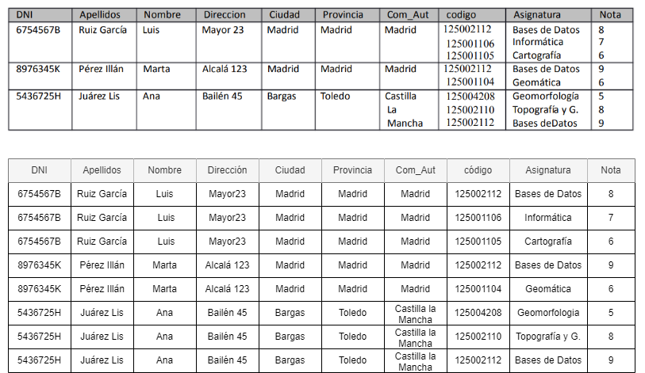

# Tarea 2: Gestión Escuela de Topografía de Madrid

## 1.Indicar las claves candidatas:

Las claves candidatas son aquellas que podrían identificar unívocamente cada tupla. En este caso podrían ser: DNI, el nombre y los apellidos podrían formar una clave  candidata (superclave), pero es peor que el DNI, ya que podrían llegar a existir dos personas con idénticos apellidos y nombres. 

## 2.Comprobar la primera forma normal:

"Una Relación está en 1FN si y sólo si cada atributo es atómico."

En la tabla dada se incumple la 1ª forma normal. Habría que separar en tuplas los distintos valores de 'Código', 'Asignatura' y 'Nota'.

## 3.Normalizar si no se cumple el apartado 2:

Ahora tengo datos repetidos, para evitar esto, separo la tabla en varias tablas:

## 4.Determinantes sobre las tablas resultado del apartado 3:

En la tabla del alumno aún hay atributos que no tienen dependencia funcional de su clave primaria (DNI), tendría que separarlos en sus respectivas tablas dónde si guarden dependencia funcional con sus claves primarias.

## 5.Indicar las claves candidatas de todas las tablas resultantes:

Tabla de provincias: provincia

Tabla de ciudades: ciudad

Tabla de alumnos: dni (podría ser también la superclave nombre + apellidos)

Tabla notas: la superclave dni + código (el de cada asignatura)

Tabla asignaturas: código
