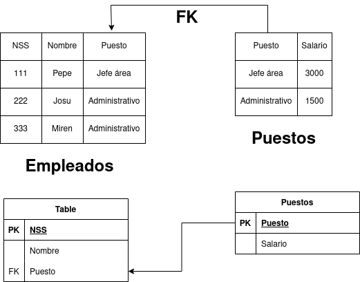

# Tarea 3: Gestión de INEM

## 1. Indicar claves candidatas

Con la información a la vista en la tabla, podrían ser claves candidatas el NSS y el nombre. El nombre es buen candidato ya que seguro que terminaría por dejar de serlo al introducirse una nueva tupla con el mismo nombre.

## 2. Comprobar si se cumple la 1ª Forma Normal

A la vista está que no se cumple, al existir atributos multivaluados en la tabla.

## 3. Normalizar si no se cumple el apartado 2

Para solucionarlo separo la información en dos tablas:

## 4. Comprobar si se cumple la 2ª Forma Normal

Teniendo en cuenta la dependencia funcional de los atributos respecto de sus claves primarias, tengo que :

La tabla de emails está en 2ª forma normal.
La tabla de empleados no lo está, ya que los salarios dependen del puesto desempeñado y no del número de la seguridad social, se tendría que extraer esa información a otra tabla.

# 5. Normalizar si no se cumple el apartado 4

