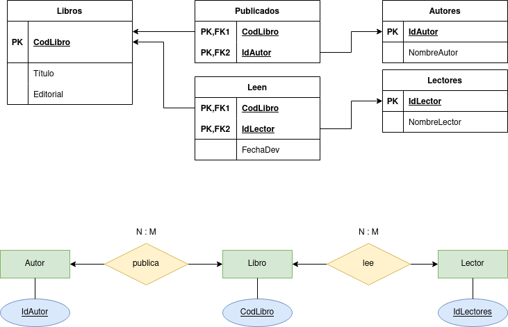

# Editorial

## 1. Comprobar si se cumple la 1ª Forma Normal.

No se cumple la primera forma normal, en el campo autor tenemos múltiples valores por tupla y en el campo lectores terminará por ocurrir lo mismo.

## 2. Normalizar si no se cumple el apartado 2.

Para poder crear las tablas correspondientes se generan varias tablas extras:

## 3. Comprobar si se cumple la 2ª Forma Normal.

No se cumplía, pero al separar las diferentes tablas en el apartado anterior pasó a cumplirse.

## 4. Normalizar si no se cumple el apartado 4.

Ya está hecho. Cada tabla tiene los atributos que dependen funcionalmente de su PK.

## 5. Comprobar si se cumple la 3ª Forma Normal.

Se cumple. La transitividad que se da en todas las tablas es de la PK a sus atributos.

## 6. Normalizar si no se cumple el apartado 5.

Se cumple.

## 7. Indicar claves de todas las tablas resultantes.

Nombre de lector no puede ser la PK de la tabla de lectores, ya que pueden existir dos lectores que se llamen igual.

Libros --> PK: CodLibro

Publicados --> PK: CodLibro + IdAutor

Leen --> PK: CodLibro + IdLector

Autores --> PK: IdAutor

Lectores --> PK: IdLector

## 8. Generar el diagrama E/R resultante.

