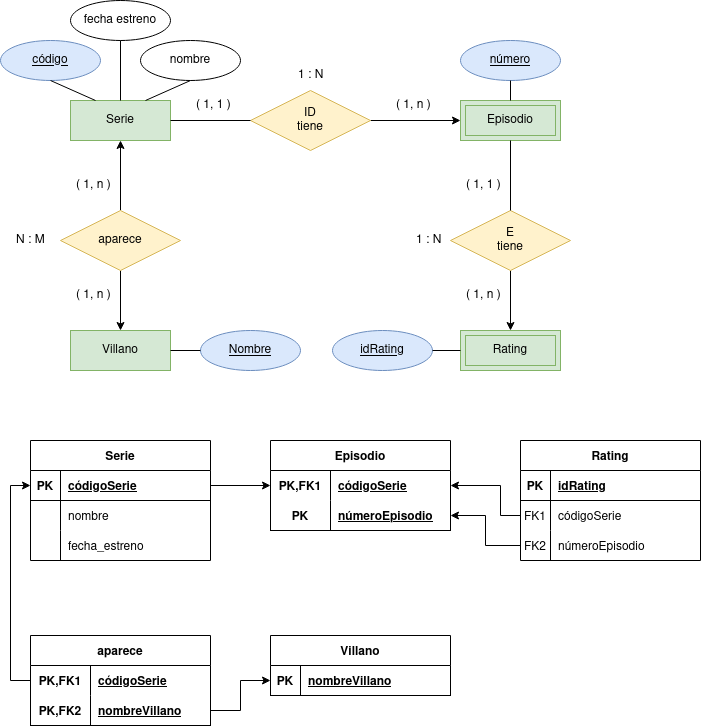

# Tarea 6: Villanos

## 1. Comprobar si se cumple la primera forma normal.

No se cumple ya que hay valores multivaluados y las claves no tienen valores únicos.

## 2. Normalizar si no se cumple el apartado 1.

## 3. Comprobar si se cumple la segunda forma normal.

Se cumple la segunda forma normal, ya que con los cambios realizados a las tablas todos los atributos tienen relación direceta con las respectivas PK.

## 4. Normalizar si no se cumple el apartado 3.

Sí se cumple.

## 5. Comprobar si se cumple la tercera forma normal.

Sí se cumple, ya que no hay transitividad entre los campos de las tablas sin pasar por la PK respectiva.

## 6. Normalizar si no se cumple el apartado 5.

Sí se cumple.

## 7. Indicar claves de todas las tablas resultantes.

Serie, PK: códigoSerie

Episodio, PK: códigoSerie + númeroEpisodio

Rating, PK: idRating

aparece, PK: códigoSerie + nombreVillano

Villano, PK: nombreVillano

## 8. Generar el diagrama E/R resultante.

